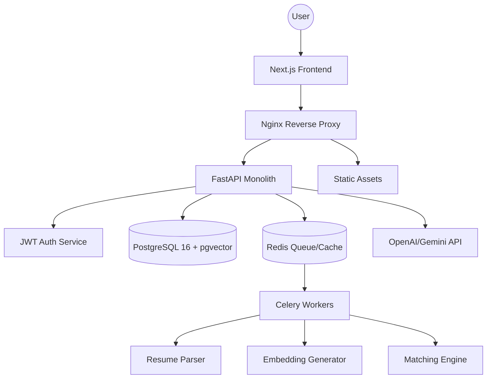

# ScrewDrivr: System Architecture Blueprint

## 1. MVP System Architecture

### Frontend → Backend Request Flow
1. **Client Request**: Next.js App Router fetches data via TanStack Query.
2. **Nginx Proxy**: Routes `/api/*` to FastAPI and `/*` to Next.js.
3. **Auth Middleware**: FastAPI validates JWT from `Authorization: Bearer` header.
4. **Service Layer**: Business logic executes, triggering DB or AI calls.
5. **Response**: Structured JSON returned with appropriate HTTP status codes.

### Architecture Diagram


## 2. Backend Design: Modular Monolith (FastAPI)

### Structure
```text
backend/
├── app/
│   ├── api/             # API Router endpoints
│   ├── core/            # Config, Security, Database setup
│   ├── models/          # SQLAlchemy ORM models
│   ├── schemas/         # Pydantic v2 models (DITOs)
│   ├── services/        # Business logic (e.g., AuthService, PlacementService)
│   ├── repositories/    # DB abstraction layer
│   ├── workers/         # Celery tasks
│   ├── rag/             # Vector search and context retrieval
│   ├── matching/        # Compatibility scoring algorithms
│   ├── analytics/       # Historical data processing
│   ├── ingestion/       # CSV/XLSX/PDF data loaders
│   ├── utils/           # Shared helpers
│   └── main.py          # Entry point
```

**Why Modular Monolith?**
- **MVP Speed**: Lower overhead than microservices (no network latency between services, shared types).
- **Refactoring**: Easy to split modules into independent services later if one exceeds resource limits.
- **Complexity**: Single deployment pipeline and consistent environment variables.

## 3. Vector Search Strategy (PostgreSQL + pgvector)

### Embedding Generation
- **Model**: `text-embedding-3-small` (1536 dimensions).
- **Logic**: Resumes and Job Descriptions are chunked and embedded asynchronously via Celery.

### SQL Setup
```sql
CREATE EXTENSION IF NOT EXISTS vector;

CREATE TABLE embeddings (
    id UUID PRIMARY KEY DEFAULT gen_random_uuid(),
    content TEXT NOT NULL,
    metadata JSONB,
    embedding vector(1536)
);

-- HNSW index for high-performance similarity search
CREATE INDEX ON embeddings USING hnsw (embedding vector_cosine_ops);
```

## 4. Background Jobs (Celery + Redis)
- **Embedding Generation**: Triggered on resume upload or news updates.
- **Resume Parsing**: OCR/Extraction using AI or specialized libraries (PyMuPDF).
- **Analytics**: Periodic recomputation of placement trends to avoid heavy read queries.

## 5. Deployment Strategy
- **Containerization**: Multi-stage Docker builds for Lean production images.
- **Orchestration**: Docker Compose for dev; Cloud Run or Kubernetes for production.
